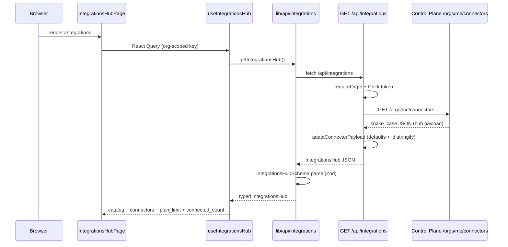

# Integrations page

How the organization **Integrations** hub (`/integrations`) loads data, which APIs it calls, and where each piece of UI copy comes from.

**Route:** `src/app/(app)/integrations/page.tsx` → `IntegrationsHubPage`  
**Layout:** `src/app/(app)/integrations/layout.tsx` (search shell)  
**Types:** `src/lib/schemas/integrations.ts`  
**Client:** `src/lib/api/integrations.ts`  
**Hooks:** `src/hooks/use-integrations.ts`  
**BFF:** `src/app/api/integrations/**`  
**Control Plane:** `GET/POST /orgs/me/connectors`, connector instance CRUD, OAuth helpers (see [lingpad-ai-agent `connectors_router.py`](../../lingpad-ai-agent/app/control_plane/connectors_router.py))

---

## Route map

| URL | Component | Primary data hook |
|-----|-----------|-------------------|
| `/integrations` | `integrations-hub-page.tsx` | `useIntegrationsHub()` |
| `/integrations/new/:slug` | `connect-wizard-page.tsx` | `useIntegrationsHub()` + `useCreateConnector()` |
| `/integrations/:type/:id` | `connector-detail-page.tsx` | `useConnectorDetail(id)` |

Sidebar entry: `src/components/app-sidebar.tsx` → `{ title: "Integrations", href: "/integrations" }`.

---

## End-to-end data flow



1. **Browser** calls the Next.js BFF at `/api/integrations` (same origin, cookies/session for Clerk).
2. **BFF** (`src/app/api/integrations/route.ts`) proxies to Control Plane `GET /orgs/me/connectors` with the user’s Clerk JWT (`controlPlaneFetch` in `src/lib/api/control-plane.ts`).
3. Response stays **snake_case** (same as Control Plane). The BFF only stringifies numeric IDs and applies small defaults via `adaptConnectorPayload`.
4. **Client** validates with `IntegrationsHubSchema` (snake_case fields) before the hub renders.

`CONTROL_PLANE_URL` or `LINGPAD_AGENT_API_URL` (default `http://localhost:8080`) is the upstream base URL.

---

## Authentication and tenancy

All integration BFF routes use `requireOrgId()` from `src/lib/api/auth.ts`:

| Condition | Status | Body |
|-----------|--------|------|
| Not signed in | `401` | `{ "error": "Unauthorized" }` |
| No active Clerk organization | `400` | `{ "error": "Organization context required" }` |

`useIntegrationsHub()` only runs when Clerk has loaded and `organization.id` is set (`enabled: isLoaded && Boolean(organization?.id)`).

Control Plane enforces **member** read access on the hub and **admin** for create/update/delete/reauth (see backend tests in `lingpad-ai-agent/tests/platform/test_connectors.py`).

---

## Hub API contract

### `GET /api/integrations` → Control Plane `GET /orgs/me/connectors`

Parsed as `IntegrationsHub`:

```ts
{
  catalog: IntegrationCatalogItem[];
  connectors: OrgConnector[];
  plan_limit: number | null;
  connected_count: number;
}
```

| Field | Source (Control Plane) | Used on hub for |
|-------|------------------------|-----------------|
| `catalog` | `Integration` rows in DB + per-plugin catalog overlay (`config_fields`, `oauth_steps`) | **Available** cards |
| `connectors` | Org `OrganizationConnector` instances (non-disconnected) | **Connected** cards |
| `plan_limit` | Billing plan `max_connectors` | Subtitle under page title |
| `connected_count` | Count of connectors returned | Same subtitle |

Standalone catalog endpoint (not used by the hub page today): Control Plane `GET /integrations/catalog`.

### Other BFF routes (related flows)

| Method | BFF path | Control Plane | Used by |
|--------|----------|---------------|---------|
| `POST` | `/api/integrations` | `POST /orgs/me/connectors` | Connect wizard |
| `GET` | `/api/integrations/:id` | `GET /orgs/me/connectors/:id` | Detail page |
| `PATCH` | `/api/integrations/:id` | `PATCH /orgs/me/connectors/:id` | Rename, capability toggles |
| `DELETE` | `/api/integrations/:id` | `DELETE /orgs/me/connectors/:id` | Delete dialog |
| `POST` | `/api/integrations/:id/reauth` | `POST /orgs/me/connectors/:id/reauth` | Reconnect |
| `POST` | `/api/integrations/:id/oauth/start` | `POST /orgs/me/connectors/:id/oauth/start` | Zendesk step OAuth |
| `GET` | `/api/integrations/:id/connect-status` | `GET .../connect-status?connect_session_id=` | Wizard polling |
| `POST` | `/api/integrations/:id/oauth` | Polls connect-status + GET connector | Mark OAuth step complete |

POST/PATCH bodies from the browser use the same **snake_case** field names as Control Plane (e.g. `integration_slug`, `display_name`, `enabled_capabilities`).

---

## Where titles and descriptions come from

### Page header (hub only)

These strings are **hardcoded in the UI**, not from the API:

| Element | Location | Text |
|---------|----------|------|
| `<h1>` | `integrations-hub-page.tsx` | `"Integrations"` |
| Subtitle `<p>` | same file | `"Connect external systems once at the organization level..."` |
| Plan usage line | same file, when `plan_limit !== null` | `` `${connected_count} of ${plan_limit} integrations used on your plan` `` |

Breadcrumbs for `/integrations` come from the build shell default (`resolveBuildBreadcrumbs` in `build-page-header.tsx`), not from the hub payload.

### Search

- **Placeholder:** `integrations/layout.tsx` → `BuildPageShell` → `searchPlaceholder="Search integrations…"`.
- **Query state:** `useBuildSearchQuery()` reads/writes `BuildPageContext` (`build-page-shell` + header search input).
- **Filtering:** Client-side only in `integrations-hub-page.tsx` (`filterConnectors`, `filterCatalog`).

### Connected integration cards

Component: `connector-instance-card.tsx` → `ConnectorInstanceCard`.

| UI field | Data source | Notes |
|----------|-------------|--------|
| Title (link) | `connector.display_name` | API / DB; user can rename via PATCH |
| Subtitle | `connector.identifier` | Computed on Control Plane (e.g. Zendesk → `{subdomain}.zendesk.com`) |
| Brand icon | `connector.integration_slug` | `IntegrationBrandIcon` → SVG assets or fallback initials |
| Capability chips | `catalog` item matched by `integration_slug` | Shows catalog capabilities vs `enabled_capabilities` on the instance |
| Sync badge | `connector.sync_status` | Derived from knowledge source sync state on backend |
| Last sync line | `connector.last_sync_attempt_at` | Formatted with `formatLastSyncAttempt` |
| Detail URL | `getConnectorPath(slug, id)` | `/integrations/{slug}/{id}` |

Rename/delete call `PATCH` / `DELETE` on `/api/integrations/:id` via `useUpdateConnector` / `useDeleteConnector`.

### Available integration cards

Component: `connector-instance-card.tsx` → `AvailableIntegrationCard`.

| UI field | Data source | Notes |
|----------|-------------|--------|
| Title | `catalogItem.name` | **`Integration.name` in Control Plane DB** |
| Description | `catalogItem.description` | **`Integration.description` in DB** (BFF sets `null` → `""`) |
| “N connected” pill | `grouped[item.slug].length` | Count from hub `connectors`, grouped by slug |
| Capability chips | `catalogItem.capabilities` | All shown as enabled (marketing view) |
| Connect vs Coming soon | `catalogItem.available` | Backend: plugin registered **and** status `active` or `beta`; BFF may default `available` for `zendesk` / `web_widget` if missing |
| Connect href | static | `/integrations/new/${item.slug}` |

OAuth step labels/descriptions on the connect wizard come from **`catalogItem.oauthSteps`** (plugin overlay on the server, not the hub page cards).

Config field labels/placeholders on the wizard come from **`catalogItem.configFields`**.

### Section headings

| Heading | Source |
|---------|--------|
| `"Connected"` | Hardcoded in `integrations-hub-page.tsx` |
| `"Available"` | Hardcoded in `integrations-hub-page.tsx` |
| Capability filter buttons | `CAPABILITY_LABELS` in `integration-utils.tsx` (`Channel`, `Knowledge`, `Actions`) |

### Empty / error states

| State | Copy source |
|-------|-------------|
| Load error | Hardcoded: “Unable to load integrations.” + refetch button |
| No search/filter matches | Hardcoded: “No integrations found” |

---

## Catalog vs fixtures (`integrations-store.ts`)

| Concern | Production path | Local fixture |
|---------|-------------------|---------------|
| Hub list + connect wizard catalog | API `catalog` from `GET /api/integrations` | `INTEGRATION_CATALOG` in `src/lib/fixtures/integrations-store.ts` is **not** wired into `/api/integrations` |
| Connector detail “catalog” metadata | **`INTEGRATION_CATALOG` imported directly** in `connector-detail-page.tsx` | Used for capability toggles / Zendesk sub-capabilities on detail |

Implication: **Available** card names/descriptions on the hub reflect the **live Control Plane catalog**. The **detail** page still resolves `catalogItem` from the static fixture list. If DB slugs or copy diverge from fixtures (e.g. backend `stripe_subscriptions` vs fixture `stripe`), detail behavior can drift until detail uses hub/API catalog.

Fixture-only field: `action_highlights` on catalog items (used on Actions hub, not on the Integrations hub).

---

## BFF normalization (`adaptConnectorPayload`)

Applied to Control Plane JSON in `src/lib/api/control-plane.ts` (no key renaming):

- Stringify numeric **IDs** (`id`, `organization_id`, `org_connector_id`)
- Empty/null catalog **descriptions** → `""`
- Filter capabilities to `channel` | `knowledge` | `action`
- Default **`connected_by`** when missing on connector objects
- Default **`available`** for catalog slugs `zendesk` and `web_widget` when boolean absent
- Default **`action_highlights`** to `[]` on catalog items
- Zendesk catalog: default **`knowledge_sub_capabilities`** to `["help_center", "tickets"]` when missing

After adaptation, `IntegrationsHubSchema` / `OrgConnectorSchema` enforce the frontend contract.

---

## React Query cache keys

| Hook | Query key |
|------|-----------|
| `useIntegrationsHub()` | `["integrations", orgId]` |
| `useConnectorDetail(id)` | `["integrations", orgId, "detail", id]` |
| `useConnectStatus(...)` | `["connect-status", connectorId, connectSessionId]` (poll every 2s when enabled) |

Mutations invalidate hub and/or detail keys on success.

---

## Related pages (brief)

### Connect wizard (`/integrations/new/:slug`)

- Loads catalog entry via **`useIntegrationsHub()`** (same API as hub).
- Page title breadcrumb: `Connect ${catalogItem.name}` from catalog **`name`**.
- Creates instance with **`POST /api/integrations`**; OAuth via connect-status polling and **`POST .../oauth`**.

### Connector detail (`/integrations/:type/:id`)

- **`useConnectorDetail(connectorId)`** → `GET /api/integrations/:id` (includes optional `notification`, `knowledge`, `channel`, `actions` tabs).
- **Title:** `connector.display_name` (API).
- **Subtitle:** `identifier`, `connected_by.name`, `connected_by.connected_at` (API).
- Tab visibility: `getDetailTabs(type)` in `connector-paths.ts` (frontend rules by integration slug).

---

## File index

| Role | Path |
|------|------|
| Hub UI | `src/components/integrations/integrations-hub-page.tsx` |
| Cards | `src/components/integrations/connector-instance-card.tsx` |
| Icons | `src/components/integrations/integration-brand-icon.tsx` |
| Labels / grouping | `src/components/integrations/integration-utils.tsx` |
| API client | `src/lib/api/integrations.ts` |
| BFF GET/POST hub | `src/app/api/integrations/route.ts` |
| Control Plane proxy helpers | `src/lib/api/control-plane.ts` |
| Zod types | `src/lib/schemas/integrations.ts` |
| Static catalog (fixtures) | `src/lib/fixtures/integrations-store.ts` |
| Backend hub serializer | `lingpad-ai-agent/app/control_plane/connectors_router.py` (`read_integrations_hub`, `serialize_catalog_item`) |

---

## Test plan (manual)

- [ ] Open `/integrations` with an org selected; hub loads without Zod/console errors.
- [ ] **Connected** cards show renamed `display_name` and correct identifier after connect.
- [ ] **Available** card title/description match Control Plane `Integration` records (not only fixture file).
- [ ] Search filters both sections by name, description, domain, slug.
- [ ] Capability filters restrict catalog and connectors.
- [ ] Plan line appears when `plan_limit` is non-null.
- [ ] Connect on an `available: true` item opens wizard; `available: false` shows “Coming soon”.
- [ ] Detail page title matches connector `display_name`; capability toggles align with catalog capabilities for that slug.
